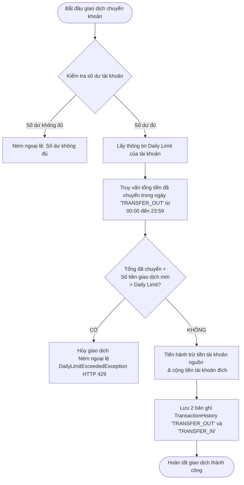

# Tài liệu Đặc tả Yêu cầu Phần mềm (SRS) - Tính năng Kiểm soát Hạn mức Chuyển khoản (Daily Limit)

## 1. Giới thiệu
Tài liệu này mô tả chi tiết yêu cầu, thiết kế và hướng giải quyết cho bài toán "Cộng dồn giao dịch trong ngày và xử lý Daily Limit" cho hệ thống Core Banking.

## 2. Mô tả Bài toán & Yêu cầu
Giám đốc Quản trị Rủi ro yêu cầu bổ sung tính năng chặn các giao dịch chuyển tiền trực tuyến vượt hạn mức trong ngày để phòng chống lừa đảo.
**Yêu cầu cụ thể:**
- Mỗi tài khoản có một hạn mức giao dịch trong ngày (Daily Limit), mặc định là 50,000,000 VNĐ.
- Khi có lệnh chuyển tiền, hệ thống phải cộng dồn tổng số tiền đã chuyển trong ngày hiện tại. Nếu giao dịch mới làm tổng số tiền vượt quá hạn mức, hệ thống phải chặn giao dịch lại và trả về thông báo lỗi.
- Hỗ trợ thêm API cho phép khách hàng tự cập nhật tăng/giảm hạn mức ngày.
- Logic kiểm tra tổng tiền phải tối ưu, sử dụng truy vấn SQL hợp lý.

## 3. Thiết kế Cơ sở dữ liệu (Database Schema)
Để theo dõi và cộng dồn giao dịch trong ngày, cần thêm cấu trúc lưu trữ `TransactionHistory` và cập nhật cấu trúc `BankAccount`.

### 3.1 Bảng `BankAccount`
- Thêm trường `dailyLimit` (Kiểu: `BigDecimal`, mặc định `50000000`).

### 3.2 Bảng `TransactionHistory` (Lịch sử giao dịch)
Lưu lại tất cả các giao dịch phát sinh để có thể thống kê và cộng dồn.
- `id` (Long, Primary Key)
- `account_id` (Long, Foreign Key -> `bank_accounts`)
- `amount` (BigDecimal, số tiền giao dịch)
- `transaction_date` (LocalDateTime, thời gian giao dịch)
- `type` (String, loại giao dịch: "TRANSFER_OUT", "TRANSFER_IN")

## 4. Giải pháp và Thuật toán (Pseudo-code)

### 4.1 Giải quyết bài toán cộng dồn "Giao dịch trong ngày"
Sử dụng câu truy vấn cơ sở dữ liệu để lấy tổng số tiền thay vì kéo tất cả lịch sử về ứng dụng rồi tính tổng. Điều này tối ưu bộ nhớ và thời gian tính toán.

**Câu lệnh JPQL Tối ưu:**
```sql
SELECT COALESCE(SUM(t.amount), 0) 
FROM TransactionHistory t 
WHERE t.bankAccount.id = :accountId 
  AND t.type = 'TRANSFER_OUT' 
  AND t.transactionDate >= :startOfDay 
  AND t.transactionDate <= :endOfDay
```
*Ghi chú:* Dùng hàm `COALESCE` (hoặc xử lý null trên Java) để phòng trường hợp khách hàng chưa thực hiện giao dịch nào trong ngày.

### 4.2 Thuật toán xử lý Daily Limit
1. Bắt đầu phiên chuyển tiền với tài khoản nguồn (`accountId`) và số tiền cần chuyển (`amount`).
2. Lấy thông tin tài khoản nguồn và số dư, kiểm tra xem số dư có đủ để thực hiện không. Nếu không, ném ra lỗi "Số dư không đủ".
3. Lấy `dailyLimit` của tài khoản nguồn.
4. Lấy `startOfDay` (00:00:00 của ngày hiện tại) và `endOfDay` (23:59:59 của ngày hiện tại).
5. Gọi hàm `sum(amount)` trong DB như mục 4.1.
6. So sánh: `(Tổng tiền trong ngày + amount) > dailyLimit`
   - Nếu `ĐÚNG`: Hủy giao dịch, ném ra ngoại lệ (ví dụ: `DailyLimitExceededException`).
   - Nếu `SAI`: Tiếp tục thực hiện trừ tiền và lưu lịch sử giao dịch.

### 4.3 Sơ đồ luồng thực thi nghiệp vụ (Mermaid Flowchart)
Dưới đây là sơ đồ trực quan hóa luồng xử lý của API chuyển khoản, minh họa cách hệ thống kiểm tra và chặn giao dịch khi vượt hạn mức:



## 5. Xử lý Lỗi & Exception Handling
Để tuân thủ yêu cầu hệ thống trả về mã lỗi thích hợp:
- Khai báo một `DailyLimitExceededException` kế thừa từ `BusinessException` (hoặc `RuntimeException`).
- Trong `GlobalExceptionHandler`, bắt (catch) ngoại lệ `DailyLimitExceededException` và thiết lập `ResponseEntity` trả về mã HTTP 429 (Too Many Requests) hoặc 403 (Forbidden) cùng message: `"Quý khách đã vượt hạn mức giao dịch trong ngày"`.

## 6. Thiết kế API
1. **API Chuyển khoản**
   - **Method:** `POST /api/bank-accounts/transfer`
   - **Body:** `{"toAccountNumber": "123456", "amount": 1000000}`
   - **Mô tả:** Core logic chuyển tiền và kiểm tra Daily Limit.

2. **API Cập nhật hạn mức**
   - **Method:** `PUT /api/bank-accounts/{accountId}/limit`
   - **Body:** `{"newDailyLimit": 100000000}`
   - **Mô tả:** Thay đổi `dailyLimit` của một tài khoản.
